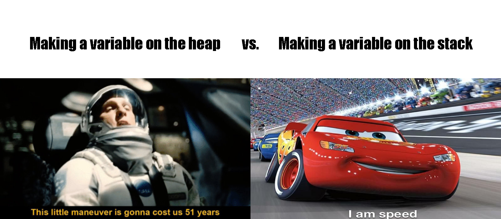

# SENG1120-PASS

### Welcome to the PASS Repository for SENG1120 PASS

If you're reading this, congratulations, you've found the right place! This repository contains all of the examples that we've been working through together and will be working through for our PASS sessions.

We'll start fairly high-pace, don't worry if you aren't 100% on every topic immediately as you go, this course can be a little brutal for beginners (particularly when we get into dereferencing and understanding properly linking when performing deconstruction based on pointers for example)

This will likely be the most C++ programming you've done at Uni so far, if you've made the effort to come along you'll love it!

---

## What you should know

### (with resources for you to catch up if you need to):

- [Basic C++ - At least 2-19 from GeeksForGeeks](https://www.geeksforgeeks.org/c-plus-plus/)

- [A fundamental understanding of C++ Datatypes](https://www.w3schools.com/cpp/cpp_data_types.asp)

- General Computer Science Terminology (See Below)

- Fundamental OOP Concepts from SENG1110 / ENGG1003

---

_This means you should be able to concisely and accurately define these terms (Potential Solns in glossary.md):_

### OOP Terms

- Class
- Encapsulation
- Method
- Constructor / Deconstructor
- Instance
- Accessor
- Mutator
- Inheritance
- Scope
- Library

### Memory and Data Terms

- Array
- RAM / Volatile Memory
- Memory Location
- Runtime
- Bit
- Byte
- Datatype
- Immutability / Mutability

### Generic Programming terms

- Variable (noun)
- Constant (noun)
- Function
- Compile
- Binary
- Executable
- Data
- Recursion
- Iteration

---

## Quick heads up, you'll talk about the HEAP and the STACK a LOT make sure you understand it in detail at a low level and how it can go wrong

**The magic of pointers is mainly that you can get the memory locations of data that is stored in the heap stored as a tiny memory location in your fast-read/write stack memory allocation (usually < 8 bytes), pass them around between functions, copy them, and so on very very quickly by comparison to reading values off the heap over and over directly**

I'd recommend this:
https://www.geeksforgeeks.org/stack-vs-heap-memory-allocation/

The minimum that you need to know is that both are TEMPORARY MEMORY ALLOCATION SCHEMES

Stack : Memory is allocated per function call, actual allocation and de-allocation times are faster, and typically the stack is smaller but information stored here dies when it falls out of scope (i.e. 'safer')

Heap : Whenever you use the **NEW** keyword in C++ you're putting information on the heap. You're in charge of making sure memory allocated here gets freed back up in C++ rather than Java, [this is what is meant by the lack of Garbage Collection in C++ and memory leaks when you don't implement it properly](https://www.geeksforgeeks.org/memory-leak-in-c-and-how-to-avoid-it/) remember to use the delete keyword appropriately and to ensure that you haven't got the pointer pointing to null or to another pointer

Threads also come into play when discussing more advanced programming techniques regarding the heap, but we don't have to worry about that in 1120 luckily. You get to cover that in Operating Systems later in your degree

---

## Useful Resources (learn how to interpret these early!!!)

https://en.cppreference.com/w/ - Essentially the manual to every c++ standard lib in detail. Just check what you're allowed to use first before writing half a task in one or practicing with them when they're not in the standard of C++ you're using (it was C++98 when I took the course and we were not allowed to use any standard lib datastructures, you had to write them yourself)

https://github.com/ - When working together to avoid conflicts on your changes, or to keep logs on your own tasks as you go as backups, no free version control tools even come close to GitHub (maybe Docker if used appropriately, but I wouldn't bother for the tasks you'll be doing in this course)

https://www.w3schools.com/cpp/default.asp - Useful tutorials for getting started if you're having trouble memorizing the basics

https://stackoverflow.com/ - It can be quite a harsh environment for beginners, but a brilliant place for seaching/reading other questions/explanations/mini-essays up there though. Just please at all costs avoid copying anything from here, not only is it plagurism if you present it as your own work obviously, but it will seriously hurt your understanding and make troubleshooting much harder for you in future, particularly when dealing with pointers and efficient tree modification stratergies.

https://www.spotify.com/au/ - You'll probably need this one, I'd suggest The Wall, Dark Side of the Moon, or Wish You Were Here if you're into Pink Floyd
